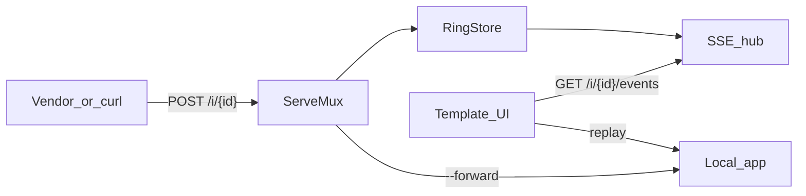

# hookd

A local webhook inspector for **zero-deps hackathon Track C**.

POST to `http://127.0.0.1:8080/i/<id>` from curl — or from a tool that already runs on your machine (Stripe CLI, a test harness). hookd captures the request, shows it live in the browser, lets you replay it, and can reverse-proxy the hop to an app on the same machine.

Nothing leaves localhost. There is no tunnel and no third-party service. `go.mod` has no `require`.

**Built with Go 1.27 only:** `net/http` ServeMux, `html/template`, `log/slog`, `encoding/json/v2`, `uuid.NewV7()`, `httputil.ReverseProxy`, `testing/synctest`. See [STDLIB.md](STDLIB.md).

## Why

At work I spend a lot of time on services that talk to each other over HTTP: a payment event, a CRM callback, an internal “we finished, now you do your part.” The painful part is never writing the handler. It is *seeing* what actually arrived, then hitting that handler again after a one-line fix.

The other side will not re-send on demand. Logs are already parsed and missing headers. A hosted requestbin means the payload sat on someone else’s box. A tunnel is more moving parts for a bug that only exists on my laptop.

hookd is the local catcher I wanted: unique inbox URLs, a live inspector, replay into the service under test, optional `--forward` so the hop is in the same session. Nothing leaves the machine.

Track C is why the stack is stdlib — useful, and `go.mod` stays empty.

## Run

Needs **Go 1.27**.

```bash
make build && ./hookd
```

The process prints a base URL and one inbox. Open the inbox in a browser, then:

```bash
curl -X POST http://127.0.0.1:8080/i/<id> \
  -H 'Content-Type: application/json' \
  -d '{"ok":true}'
```

The UI updates over SSE. `GET /i/{id}` is the inspector; every other method on that path is captured.

`make test` runs the suite. `make reproduce` builds twice (`CGO_ENABLED=0`, `-trimpath`) and checks the SHA-256s match.

### Forward

Start hookd pointed at a local app (path is preserved, so `/i/<id>` arrives on the app as `/i/<id>`):

```bash
./hookd -forward http://127.0.0.1:9999
```

Then POST the inbox as usual. hookd stores the request, reverse-proxies it to `:9999`, and the client gets the app's status and body (not `{ok,id}`). The UI shows the hop on that record.

### Replay

Start with a default target, or leave it empty and set the URL in the UI:

```bash
./hookd -replay-url http://127.0.0.1:9999/hook
```

After a request is captured, Replay in the inspector (or the JSON below) rebuilds method, headers, and body and POSTs them at the target. The upstream status is stored on the record.

```bash
curl -X POST http://127.0.0.1:8080/i/<id>/replay \
  -H 'Content-Type: application/json' \
  -d '{"id":"<record-id>","target":"http://127.0.0.1:9999/hook"}'
```

If `target` is omitted, `-replay-url` is used.

### Features

- **Capture** — any non-GET on `/i/{id}` stores method, path, query, headers, body, remote addr, and timing
- **Inspect** — self-contained UI: list, headers, pretty JSON, raw, hex; copy-as-curl
- **Live** — `GET /i/{id}/events` streams new records into the open page
- **Replay** — send a stored request at `-replay-url` or a UI target
- **Forward** — after capture, proxy the same request to a local app
- **Several inboxes** — mint more from the landing page; each has its own ring

### Flags

| Flag | Default | `.env` |
|---|---|---|
| `-addr` | `127.0.0.1:8080` | `ADDR` |
| `-max` | `500` requests per inbox | `MAX` |
| `-forward` | off | `FORWARD` |
| `-replay-url` | off | `REPLAY_URL` |

An optional `.env` (`KEY=VALUE`, `#` comments) sets those defaults. Flags override. `NO_COLOR` turns off the ANSI banner; logs stay `log/slog`. SIGINT and SIGTERM call `http.Server.Shutdown`.

## Design

`cmd/hookd` is flags, signals, and the listen loop. HTTP lives in `internal/server`. Memory and the ring live in `internal/store`. Pages are `html/template` in `internal/ui`. Copy-as-curl and `.env` parse are small packages next to them.



A capture writes the record, notifies the hub, and — if `-forward` is set — proxies the same body to the upstream and stores that hop. The UI loads the list as JSON, then stays current over SSE. Replay rebuilds method, headers, and body against a URL you choose.

**How it runs:** one goroutine per `net/http` request, `sync.Mutex` on the store, one hub goroutine that broadcasts. No worker pool.

Routes (ServeMux; more specific wins):

| Pattern | Role |
|---|---|
| `GET /` | Landing; mint another inbox |
| `POST /inboxes` | Create inbox (`uuid.NewV7()`) |
| `GET /i/{id}` | Inspector |
| `GET /i/{id}/events` | SSE |
| `GET /i/{id}/requests` | JSON list |
| `POST /i/{id}/replay` | Replay one record |
| `/i/{id}` | Capture |

CSRF uses `http.NewCrossOriginProtection`. Capture on `/i/{id}` is bypassed so a vendor that sends `Origin` still lands. Replay and “new inbox” stay same-origin.

## Scope

- Loopback by default (`127.0.0.1`) — a debug tool on this machine, not a public requestbin
- In-memory ring per inbox (`-max`, default 500) — enough for a session; restart starts clean
- Request bodies truncate at 1 MiB
- No tunnel — cloud vendors reach hookd only through something local (curl, Stripe CLI, your tests)

## Future

This stays a laptop tool on purpose. If I keep working on it:

- **Package** — ship it as something you can install, not only `make build`. `go install` first; a Homebrew formula or a versioned binary if people actually use it.
- **Vendor adapters** — first-class help for Stripe, GitHub, Meta, and similar: known payload shapes, signature headers, and the subscribe handshake those APIs expect (today you fake that with curl).
- **Tunnel** — optional public URL in front of the inbox (ngrok or equivalent) so a real vendor dashboard can POST into hookd. That is the missing piece for “paste this URL into Stripe/GitHub/Meta.” It stays opt-in; the default remains localhost.

MIT. Substitution list: [STDLIB.md](STDLIB.md).
